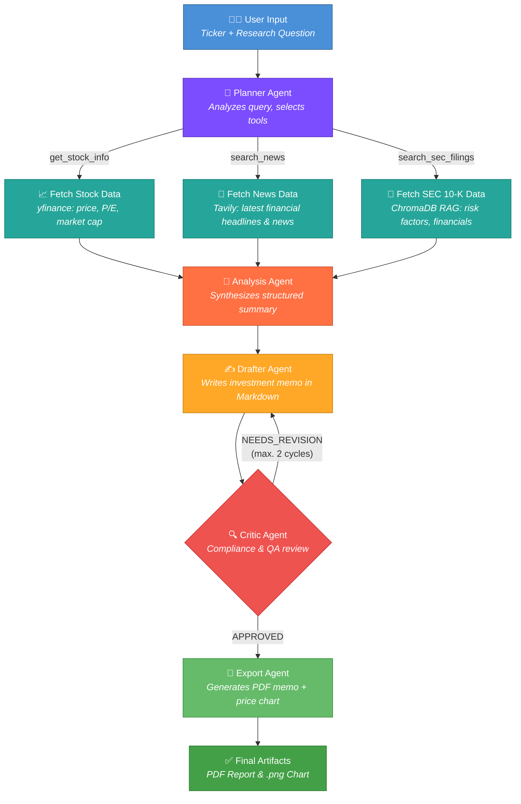

<p align="center">
  <h1 align="center">📈 Agentic Equity Research</h1>
  <p align="center">
    <strong>An autonomous, multi-agent investment research system powered by LangGraph and Gemini.</strong>
    <br />
    Enter a ticker. Ask a question. Get an investment memo - generated entirely by AI agents.
  </p>
  <p align="center">
    
    
    
    
    
    
  </p>
</p>

---

##  What Is This?

**Agentic Equity Research** is an end-to-end, AI-driven investment analysis pipeline. A user submits a stock ticker and a research question through a **Streamlit** frontend. The **FastAPI** backend orchestrates a team of specialized LangGraph agents that autonomously **plan**, **fetch data**, **analyze**, **draft**, **critique** and **export** a professional investment memo - complete with a 6-month historical price chart and a downloadable PDF.

The agents don't just generate text. They reason about _what data is needed_, fetch it from multiple real-world sources in parallel, synthesize a structured analysis, draft a memo, run it through a compliance critic for quality assurance and only then produce the final artifacts.

---

##  Features

| Feature | Description |
| :--- | :--- |
|  **Multi-Agent LangGraph Pipeline** | A stateful graph of 8 specialized nodes - Planner, 3 parallel Data Fetchers, Analyst, Drafter, Critic and Exporter - orchestrated by LangGraph with conditional routing. |
|  **Real-Time Async Streaming** | The FastAPI backend streams `ndjson` events as each agent completes its task. The Streamlit UI renders live progress updates so you see the agents _thinking_. |
|  **Multi-Source Data Fusion** | Agents pull from **SEC 10-K filings** (local RAG via ChromaDB), **live market data** (yfinance) and **current news** (Tavily) - all in parallel. |
|  **Intelligent Planning** | The Planner agent analyzes the user's query and selectively activates _only_ the data tools that are relevant, minimizing latency and API calls. |
|  **Built-in Quality Control** | A Critic agent reviews every draft against the raw source data, flagging unsupported claims. Up to 2 revision cycles ensure accuracy before export. |
|  **PDF & Chart Artifacts** | Final outputs are a professionally styled PDF investment memo and a 6-month price chart (`.png`), saved to a shared `./outputs` volume. |
|  **One-Command Docker Deploy** | A single `docker compose up --build` spins up both the backend and frontend with shared volumes. |

---

##  Architecture

The system is built as a **directed acyclic graph** (DAG) of LangGraph agent nodes. The Planner dynamically routes to only the required data-fetching nodes, which execute **in parallel**. The Critic introduces a conditional feedback loop for self-correction before final export.



---

##  Quick Start (Docker)

### Prerequisites

- [Docker](https://docs.docker.com/get-docker/) & [Docker Compose](https://docs.docker.com/compose/install/)
- A [Gemini API Key](https://aistudio.google.com/apikey)
- A [Tavily API Key](https://app.tavily.com)

### 1. Clone the repository

```bash
git clone https://github.com/bogdan-feier/agentic-equity-research.git
cd agentic-equity-research
```

### 2. Configure environment variables

```bash
cp .env.example .env
```

Open `.env` and add your API keys:

```env
GEMINI_API_KEY=your_gemini_api_key_here
TAVILY_API_KEY=your_tavily_api_key_here
```

### 3. Launch with Docker Compose

```bash
docker compose up --build
```

This spins up two containers:

| Service | URL | Description |
| :--- | :--- | :--- |
| **Backend** | `http://localhost:8000` | FastAPI server with streaming research endpoint |
| **Frontend** | `http://localhost:8501` | Streamlit UI for submitting queries and viewing results |

> [!TIP]
> Both containers share the `./outputs` volume. Generated PDFs and charts are saved there and accessible from either service - and from your host machine.

### 4. Generate a report

1. Open **http://localhost:8501** in your browser.
2. Enter a stock ticker (e.g., `NVDA`) and a research question.
3. Watch the agents work in real-time, then download your PDF.

---

##  Project Structure

```
agentic-equity-research/
├── app.py                    # Streamlit frontend
├── api.py                    # FastAPI backend with streaming endpoint
├── ingest.py                 # Script to ingest 10-K PDFs into ChromaDB
├── agent/
│   ├── agent.py              # LangGraph workflow definition & graph builder
│   └── utils/
│       ├── state.py          # TypedDict state schema for the agent graph
│       ├── nodes.py          # All agent node implementations (8 nodes)
│       └── tools.py          # Tool definitions (yfinance, Tavily, ChromaDB)
├── data/                     # Sample SEC 10-K filings (AAPL, NVDA, TSLA, etc.)
├── chroma_db/                # Persisted vector store for SEC filing embeddings
├── outputs/                  # Generated PDFs and charts (shared Docker volume)
├── docker-compose.yml
├── Dockerfile.backend
├── Dockerfile.frontend
├── requirements.txt
└── .env.example
```

---

##  Local Data & SEC Filing Ingestion

The `data/` folder ships with sample **SEC 10-K annual reports** for 8 major companies, ready for local testing:

| Ticker | Company |
| :---: | :--- |
| `AAPL` | Apple Inc. |
| `AMZN` | Amazon.com Inc. |
| `GOOG` | Alphabet Inc. |
| `JPM` | JPMorgan Chase & Co. |
| `MSFT` | Microsoft Corp. |
| `NVDA` | NVIDIA Corp. |
| `TSLA` | Tesla Inc. |
| `WMT` | Walmart Inc. |

To ingest a 10-K filing into the ChromaDB vector store for RAG retrieval:

```bash
python ingest.py NVDA
```

This chunks the PDF, generates embeddings via `gemini-embedding-001` and persists them to `chroma_db/NVDA/`. The research agents will automatically query this vector store when SEC data is needed.

> [!NOTE]
> You can add your own 10-K filings by saving them to `data/` as `{TICKER}_10K.pdf` and running the ingestion script.

---

##  Running Locally (Without Docker)

```bash
# Create and activate a virtual environment
python -m venv .venv
source .venv/bin/activate

# Install dependencies
pip install -r requirements.txt

# Configure environment
cp .env.example .env
# Edit .env with your API keys and uncomment the API_URL line:
# API_URL=http://127.0.0.1:8000/research

# Start the backend
uvicorn api:app --host 0.0.0.0 --port 8000

# In a separate terminal, start the frontend
streamlit run app.py
```

---

##  Tech Stack

| Layer | Technology | Purpose |
| :--- | :--- | :--- |
| **LLM** | Gemini 3.1 Flash Lite | Reasoning, analysis and report generation |
| **Agent Framework** | LangGraph | Stateful multi-agent orchestration with conditional edges |
| **Embeddings** | Gemini Embedding 001 | Semantic search over SEC 10-K filings |
| **Vector Store** | ChromaDB | Local persistent RAG for SEC filings |
| **Market Data** | yfinance | Real-time stock prices, ratios and historical charts |
| **News Search** | Tavily | Web search for real-time market news and headlines |
| **Backend** | FastAPI + Uvicorn | Streaming NDJSON API for real-time agent updates |
| **Frontend** | Streamlit | Interactive research UI with live progress tracking |
| **PDF Export** | WeasyPrint + Markdown | Styled HTML → PDF conversion for investment memos |
| **Containerization** | Docker Compose | One-command deployment of the full stack |

---

##  License

This project is licensed under the **MIT License** - see the [LICENSE](LICENSE) file for details.

---
